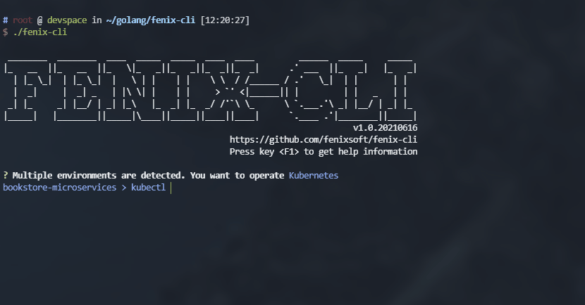
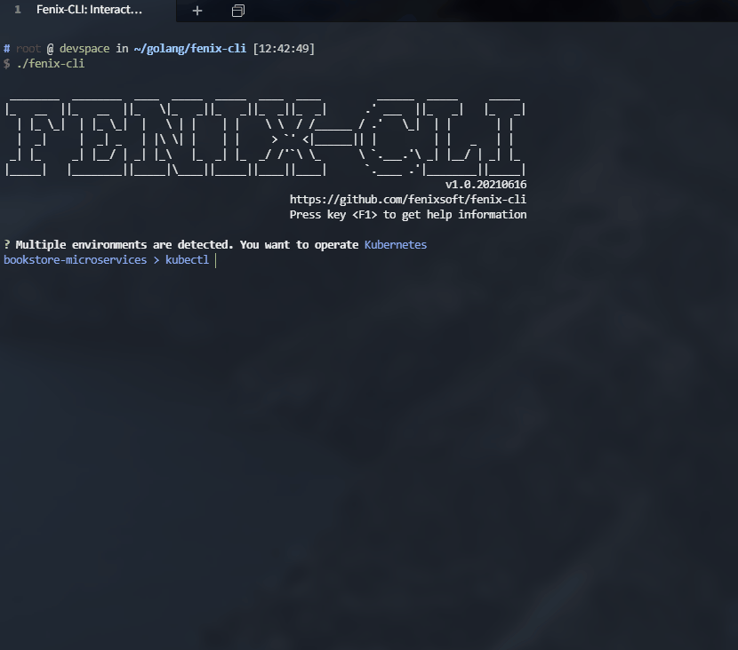

# Fenix-CLI：Interactive Cloud-Native Environments Client

<a href="https://travis-ci.com/fenixsoft/fenix-cli" target="_blank" style="display:inline-block" class="not-print"></a>
<a href="https://icyfenix.cn/introduction/about-me.html" target="_blank" style="display:inline-block"></a> 
<a href="https://www.apache.org/licenses/LICENSE-2.0" target="_blank" style="display:inline-block"></a> 
<a href="https://github.com/fenixsoft/fenix-cli/releases" target="_blank" style="display:inline-block"></a>

**English** | [简体中文](README_CN.md)

Fenix-CLI is an interactive cloud-native operating environment client. The goal is to replace Docker's `docker cli`, Kubernetes`kubectl`, Istio's `istioctl` command-line tools, providing consistent operation and interactive terminal interface with enhanced instructions and intelligent completions.

## Feature

Compared with the official original clients of Docker, Kubernetes, and Istio, Fenix-CLI has the following features:

1. **Multiple operating environment support**<br/>Fenix-CLI currently supports three operating environments: Docker, Kubernetes, and Istio, and plans to expand to other commonly used cloud native environments such as OpenShift, Rancher, Podman, and Containerd. It will automatically detect at startup, list the installed environment for users to choose, and you can also use the shortcut key `F2` to switch at any time during runtime.


2. **Auto-completions for static commands**<br/>Fenix-CLI supports all the commands and parameters of the official original client, and provides auto-completions and descriptions for them. Most of the command descriptions are from the following official reference documents:
   - [https://docs.docker.com/engine/reference/commandline/cli/](https://docs.docker.com/engine/reference/commandline/cli/)
   - [https://kubernetes.io/docs/reference/generated/kubectl/kubectl-commands](https://kubernetes.io/docs/reference/generated/kubectl/kubectl-commands)
   - [https://istio.io/latest/docs/reference/commands/istioctl/](https://istio.io/latest/docs/reference/commands/istioctl/)


3. **Intelligent completions for dynamic context**<br/>In addition to static command auto-completions, Fenix-CLI can also perceive dynamic data in the context, and support intelligent completions for these resources. For example, the names and statuses of containers and images in Docker; the names and statuses of various resources such as pod, deployment, service in Kubernetes; expose ports and file \ directory information of the containers \ pod \ services. Currently supported dynamic data includes:
   - Docker：
     - Image name and status 
     - Container name and status 
     - Internal information, such as: the port number exposed by the container, file path, etc.
   - Kubernetes / Istio：
     - The name and status of various resources: Pod, ComponentStatus, ConfigMap, Context, DeamonSet, Deployment, Endpoint, Ingress, Job, LimitRange, Node, Namespace, PersistentVolume, PodSecurityPolicy, PodTemplete, ReplicataSet, ReplicationController, ResourceQuota, ServiceAccount, Container, Events
     - Global information, such as cluster context and namespace, etc.
     - Internal information, such as: the port number exposed by the service, file path, etc.



4. **Interactive batch operation**<br/>In order to facilitate the management of multiple resources at the same time, Fenix-CLI provides interactive CUI operations, supporting single / multiple selection, and filtering to meet the requirements of performing similar operations on multiple resources at one time.


5. **X-Commands**<br/>In addition to supporting all standard commands of the original client, Fenix-CLI has also extended a series of proprietary commands beginning with `x-`. These X-Commands are the main value of Fenix-CLI, which can be viewed through shortcut key `F1` or `x-help`.<br/>Many X-Commands in Fenix-CLI are base on some krew plugins. To simplify plug-in installation, Fenix-CLI has been integrated with [Kubernetes Krew](https://github.com/kubernetes-sigs/ krew) plug-in framework, so you can use all krew plug-ins without any additional operations. The following is a list of some of the X-Commands:
   - Switch kubernetes cluster context and namespace<br/>`x-context` is used to switch the cluster managed by the current kubernetes client, which is suitable for the situation where one client manages multiple clusters.<br/>`x-namespace` is used to switch the namespace of kubernetes client to simplify the tedious operation of having the `--namespace <ns>` parameter in each command. The current namespace will also be listed before the prompt.
     
   - Batch management of resources<br/>`x-batch` is used to manage resources in batches. It can be used for containers and images in docker, as well as more than 10 resources such as pod, deployment, and service in kubernetes. The use of the `x-batch` command has been demonstrated in the previous introduction to the interactive CUI.
   - Network traffic tracking<br/>`x-sniff` is used to record pod network traffic. For the traffic of gateway services, we can usually check it easily on the browser, but the network access to the internal nodes of the microservice cluster is more inconvenient and usually requires special tracking systems. `x-sniff` automatically injects tcpdump without installing any tracking system to send traffic information to TShark or Wireshark for analysis (so you still need to install TShark or Wireshark on your worksation). At the same time, in order to simplify the complex parameters of TShark, two display formats are provided by default, `summary` (display only the call request summary) and `detail` (display the full text of HTTP Header and Body). This command is implemented based on the sniff plug-in: [https://github.com/eldadru/ksniff](https://github.com/eldadru/ksniff)
     
   - Check the relationship between resources<br/>`x-lens` is used to check and display the owner relationship between related resources through pods. This command is implemented based on the pod-lens plug-in: [https://github.com/sunny0826/kubectl-pod-lens](https://github.com/sunny0826/kubectl-pod-lens)
     
   - Quick access to services<br/>`x-open` is used to automatically establish port forwarding according to the port exposed by the service, and open a browser in the client to directly access the service. This command is implemented based on the open-svc plug-in: [https://github.com/superbrothers/kubectl-open-svc-plugin](https://github.com/superbrothers/kubectl-open-svc-plugin)
   - Check cluster service status<br/>`x-status` is used to check which resources in the current Kubernetes cluster are operational and which have problems. `x-status` simplifies the trouble of repeatedly `kubectl get`. This command is implemented based on the status plug-in: [https://github.com/bergerx/kubectl-status](https://github.com/bergerx/kubectl-status)
     
   - ……

## Installation & Usage

- Installation: install the latest version of Fenix-CLI through the following script:

   ```bash
   curl -sL https://icyfenix.cn/fenix-cli/dl.sh | sh -
   ```

- Manual installation: if you need other versions, you can get the executable file of Fenix-CLI on the [GitHub Release](https://github.com/fenixsoft/fenix-cli/releases) page.

- Usage: after installation, enter `fenix-cli` to use

  ```bash
  fenix-cli
  ```

- Fenix-CLI only supports Linux operating system

## Roadmap

The main features of the subsequent versions of Fenix-CLI are planned as follows:

- Plan to refactor the auto-completions architecture. At present, auto-completions for static commands / parameters are directly built in the program code, based on Docker v20.10.7 (June 2021), Kubernetes v1.21 (April 2021), Istio v1.10 (May 2021). With the continuous development and expansion of official client functions, depend on program to follow is bound to be unsustainable. Fortunately, the current mainstream cloud-native clients all use [spf13/cobra](spf13/cobra) as the CLI framework. Therefore, the next major version plans to refactor the Fenix-CLI auto-completions architecture to support driving through external DSL. And achieve the real-time acquisition of command and parameter information directly from docker / kubernetes environment on the workstation, and automatically generate DSL, so as to achieve the purpose of automatically following the upgrade of the official client.
- Plan to support more cloud-native operating environments, such as OpenShift, Rancher, Podman, Containerd, etc.
- Plan to support more X-Commands, such as:
  - `x-log`: Automatically aggregate the log output of multiple pods. Currently `kubectl logs` can only monitor a single pod. It is planned to provide a command to aggregate multiple pod logs related to microservices into one screen for scrolling tracking.
  - `x-debug`: Advanced debugging capabilities of the container. Starting from Kubernetes 1.18, the `kubectl debug` command is provided to inject the debugging container for Pod (1.15-1.17 is Ephemeral Feature). It is planned to find or make a Swiss army knife-style debugging image with common network tools and simplification enough to let Fenix-CLI The image can be called to quickly enter the Pod for problem diagnosis.
  - ……
- Plan to support the automatic installation of the cloud-native environment. Due to the limitations of GFW, cloud-native environments such as Kubernetes need to access the Google`s repository, which is inconvenient to install. Therefore, consider the ability to provide one-click deployment of the cloud-native environment in Fenix-CLI. This feature does not require much work on the client, but it is more cumbersome for the server to make a robot that automatically pulls mirror images from abroad.
- Plan to support multiple languages, at least Chinese language support will be provided, and there will be a certain translation workload.
- Plan to complete unit-test and E2E test.
- Plan to provide some specific cases of using Fenix-CLI to operate and maintain, diagnose, and make errors in a real scene.

## Community

- Bug reports:
  - If you have a problem with the Fenix-CLI itself, please file an issue in this repository.
  - If you're having an issue with a krew plugin, file an issue for the repository the plugin's source code is hosted at.
- Contributing:
  - Welcome pull request, feature request, and any form of collaboration.
- Special thanks:
  - Special thanks [c-bata](https://github.com/c-bata): The command line prompt framework of the Fenix-CLI project is based on [c-bata/go-prompt](https://github.com/c-bata/go-prompt), some Kubernetes prompt functions directly use [c-bata/kube-prompt](https://github.com/c-bata/kube-prompt) code.

## License

- - This software is licensed under the Apache 2.0 license, see [LICENSE](https://github.com/fenixsoft/fenix-cli/blob/main/LICENSE) for more information.

